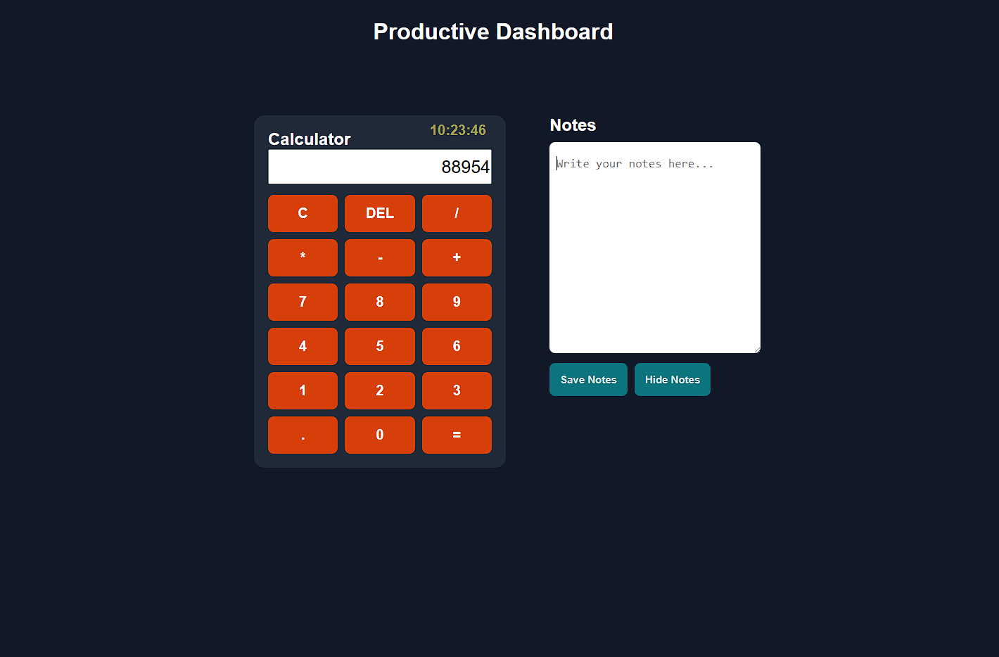
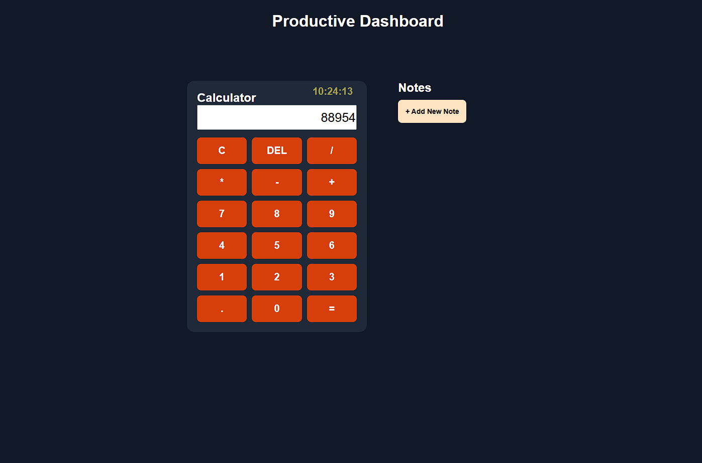

# Productivity Dashboard

A simple and responsive **Productivity Dashboard** built using **HTML, CSS, and JavaScript**.

This dashboard combines useful daily tools like a calculator, digital clock, and a notes application in one place.

---

## Features 

### 🕒 Digital Clock
- Displays real-time current time
- Automatically updates every second using JavaScript

### 🧮 Calculator
- Basic arithmetic operations
- Supports:
  - Addition (+)
  - Subtraction (-)
  - Multiplication (*)
  - Division (/)
  - Decimal values

### 📝 Notes Application
- Notes are hidden by default
- "Add New Note" button opens the notes section
- Hide notes option available
- Saves notes using browser `localStorage`
- Notes remain saved after refreshing the page

---

## Technologies Used 

- HTML5
- CSS3
- JavaScript
- LocalStorage 

---

## Screenshots





## Project Structure 

```bash

